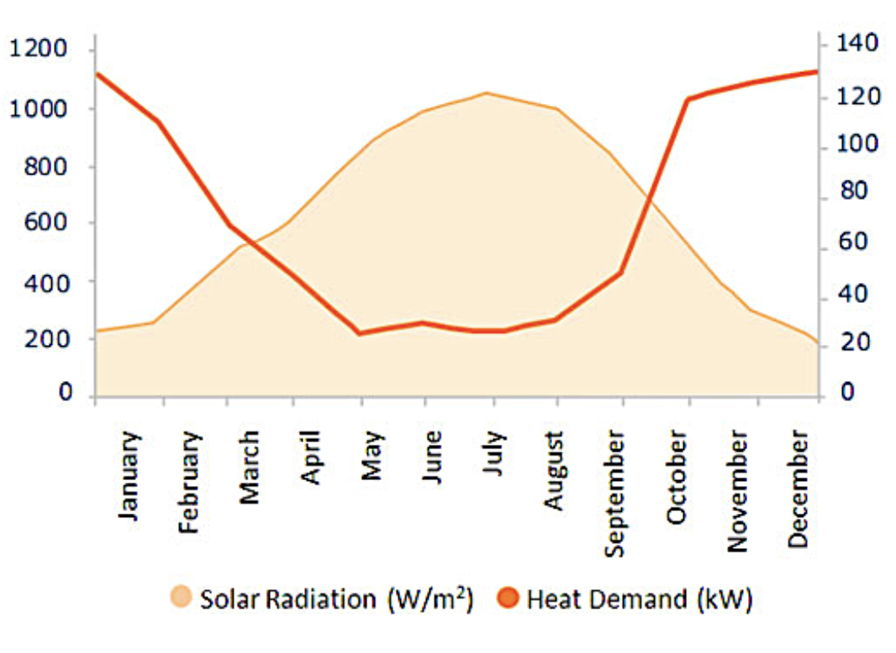
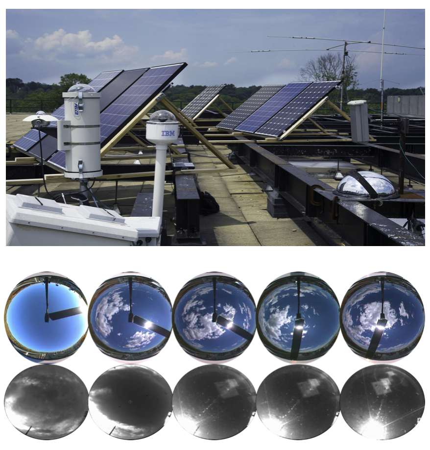
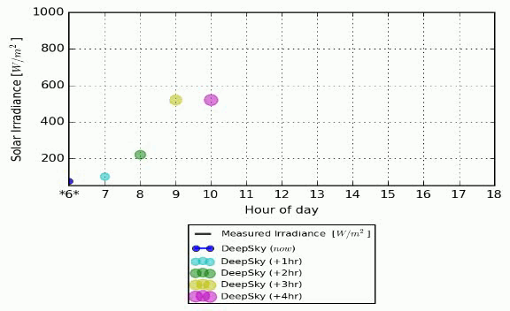
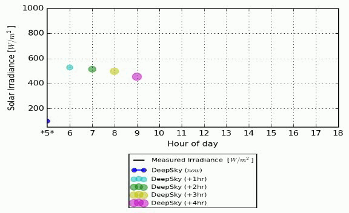
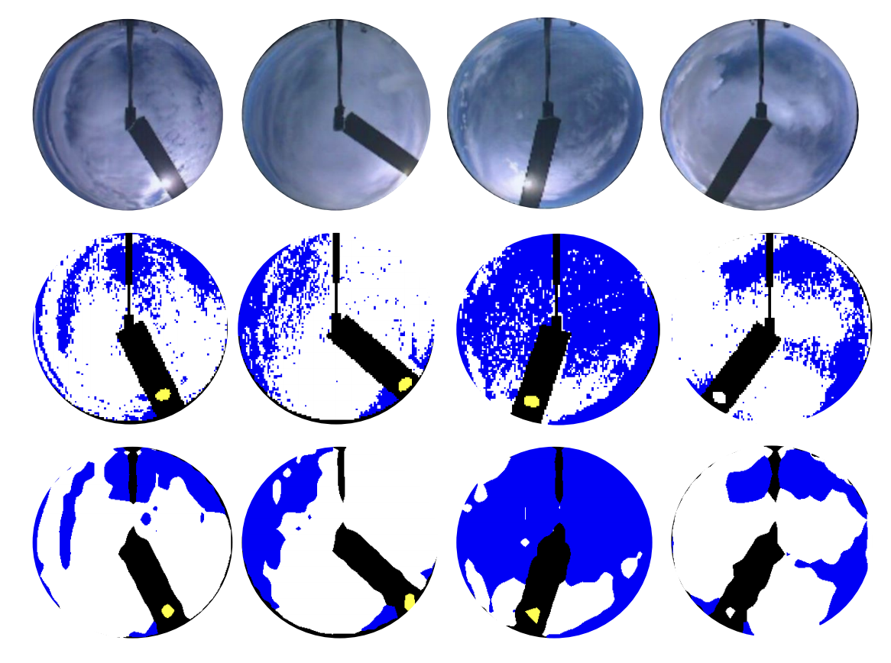

<!DOCTYPE html>
<html lang="en-us">
  <head>
    <meta charset="UTF-8">
    <title>SkyCam</title>
    <meta name="viewport" content="width=device-width, initial-scale=1">
    <meta name="theme-color" content="#157878">
    <link rel="stylesheet" href="css/normalize.css">
    <link href='https://fonts.googleapis.com/css?family=Open+Sans:400,700' rel='stylesheet' type='text/css'>
    <link rel="stylesheet" href="css/cayman.css">
  </head>
  <body>
    <section class="page-header">
      <h1 class="project-name">Solar Irradiance forecasting using a Sky-Camera</h1>
      <h2 class="project-tagline">Project Page for our paper titled "A deep learning approach to solar-irradiance forecasting in sky-videos"</h2>
      <!-- <h2 class="project-tagline">Talha Ahmad Siddiqui, Samarth Bharadwaj, Shivkumar Kalyanaraman (2019)</h2> -->
      <!-- <a href="https://drive.google.com/file/d/1fKMXoaWLJaR985eILwY1nfaxXB2x7x5Y/view?usp=sharing" class="btn">View Paper</a> -->
      <a href="https://drive.google.com/file/d/1fKMXoaWLJaR985eILwY1nfaxXB2x7x5Y/view?usp=sharing" class="btn">View Paper</a>
      <a href="#" class="btn">Code (releasing soon)</a>
      <a href="#" class="btn">Data (releasing soon)</a>
    </section>

    <section class="main-content">

      

        Production of alternative energy sources, such as solar energy, are governed by the vagaries of weather. For instance, indoor heating demands are inversely correlated with solar radiation availability. The important question is how does one estimate solar energy production efficiently in order to solve the demand-supply mismatch in alternate energy. The below figure depicts this scenario graphically. 
      

      

      

        Weather phenomenon is a complex physical causation that are difficult to model accurately. Existing solutions to solar irradiance prediction and forecasting, are <strong>expensive</strong> (high subscription fee), <strong>require satellite readings</strong> (high computational cost and infrastructure) and are prone to <strong>high latency</strong> (two measurements per day). We propose in our research work the use of sky-camers to forecast solar irradiance.
      

      <!-- 
 Ahead-of-time forecasting of incident solar-irradiance on a panel is indicative of energy yield and is essential for efficient grid distribution and planning. Typical approaches are based on meteorological physics models whose parameters are tuned by coarse-grained radiometric tiles sensed from geo-satellites.
      
 -->

      <h2>
      <a id="user-content-header-2" class="anchor" href="#header-2" aria-hidden="true"></a>What is a Sky-Camera?</h2>

      

        A sky-camera is an inexpensive upward facing wide-lensed camera that can be easily deployed in solar farms and roof-tops. The high accuracy and low latency of predictions with the help of a sky-camera can give rise to many interesting applications such as <strong>demand-supply matching, energy storage optimization, and predictive panel maintenance solutions.</strong> The figure below shows an example of commercial sky-cameras deployed in the vicinity of solar farms and some sample unprocessed frames from two different sky-cameras. 
      

      

      <h2>
      <a id="user-content-header-2" class="anchor" href="#header-2" aria-hidden="true"></a>Proposed Approach</h2>
      

      This research presents a <strong>deep learning approach</strong> to observe and estimate short-term weather effects from sky-videos obtained with sky-cameras and directly forecast solar irradiance. Our approach utilizes dilating convolution filters to learn a full-sky representation at varying scales via joint-training aided by auxiliary weather parameters that are sensed simultaneously. The architecture diagram for our approach is illustrated below.
      

      

      <h2>
      <a id="user-content-header-2" class="anchor" href="#header-2" aria-hidden="true"></a>Performance and Analysis</h2>

      

        Here are two sample videos in the month of April from two datasets obtained from Arizona and Colorado in the United States respectively. We chose these videos, as they illustrate the challenges of irradiance forecasting (torrential rainy days in early summer).
      

      

        Corresponding to each frame, the interpolated mean of the <a href="https://arxiv.org/abs/1411.5752">hypercolomns</a> is plotted that is indicative of the focus of convolution filters. Further, the measured irradiance is plotted along with the nowcast prediction and ahead of time forecast (+1, +2, +3, & +4) hours.
      

      

      

      
      

        The Colorado video setup (TSI) consists of a sun tracker to protect the lens and equipment from direct exposure to the sun. Hence, the autofocus allows the camera to capture the clouds more clearly. We pick a challenging video from the dataset with large intra-day variations in solar irradiance. Notice, that the error in nowcasting is higher, when the sun tracker miss-fires.
      

      

      

      <h2>
      <a id="user-content-header-2" class="anchor" href="#header-2" aria-hidden="true"></a>Future Work</h2>
      
      

        We have extended our present work to perform <strong>future frame semantic segmentation</strong> on sky videos in order to further improve the results of our solar irradiance forecasting. Our initial results and proposed approach <a href="https://arxiv.org/pdf/1812.10786.pdf">is available on arXiv.</a> The below figure lists sample semantic segmentation of <em>now</em> predictions. The three rows in the illustration are a sequence of input frames, the corresponding ground truth and semantic masks generated from our approach, respectively.
      

      

      

      <!-- 
Text can be <strong>bold</strong>, <em>italic</em>, or <del>strikethrough</del>. <a href="https://github.com">Links</a> should be blue with no underlines (unless hovered over).

      
There should be whitespace between paragraphs. There should be whitespace between paragraphs. There should be whitespace between paragraphs. There should be whitespace between paragraphs.

      
There should be whitespace between paragraphs. There should be whitespace between paragraphs. There should be whitespace between paragraphs. There should be whitespace between paragraphs.

      <blockquote>
      
There should be no margin above this first sentence.

      
Blockquotes should be a lighter gray with a gray border along the left side.

      
There should be no margin below this final sentence.

      </blockquote>

      <h1>
      <a id="user-content-header-1" class="anchor" href="#header-1" aria-hidden="true"></a>Header 1</h1>

      
This is a normal paragraph following a header. Bacon ipsum dolor sit amet t-bone doner shank drumstick, pork belly porchetta chuck sausage brisket ham hock rump pig. Chuck kielbasa leberkas, pork bresaola ham hock filet mignon cow shoulder short ribs biltong.

      <h2>
      <a id="user-content-header-2" class="anchor" href="#header-2" aria-hidden="true"></a>Header 2</h2>

      <blockquote>
      
This is a blockquote following a header. Bacon ipsum dolor sit amet t-bone doner shank drumstick, pork belly porchetta chuck sausage brisket ham hock rump pig. Chuck kielbasa leberkas, pork bresaola ham hock filet mignon cow shoulder short ribs biltong.

      </blockquote>

      <h3>
      <a id="user-content-header-3" class="anchor" href="#header-3" aria-hidden="true"></a>Header 3</h3>

      <pre><code>This is a code block following a header.</code></pre>

      <h4>
      <a id="user-content-header-4" class="anchor" href="#header-4" aria-hidden="true"></a>Header 4</h4>

      <ul class="task-list">
      <li>This is an unordered list following a header.</li>
      <li>This is an unordered list following a header.</li>
      <li>This is an unordered list following a header.</li>
      </ul>

      <h5>
      <a id="user-content-header-5" class="anchor" href="#header-5" aria-hidden="true"></a>Header 5</h5>

      <ol class="task-list">
      <li>This is an ordered list following a header.</li>
      <li>This is an ordered list following a header.</li>
      <li>This is an ordered list following a header.</li>
      </ol>

      <h6>
      <a id="user-content-header-6" class="anchor" href="#header-6" aria-hidden="true"></a>Header 6</h6>

      <table>
      <thead>
      <tr>
      <th>What</th>
      <th>Follows</th>
      </tr>
      </thead>
      <tbody>
      <tr>
      <td>A table</td>
      <td>A header</td>
      </tr>
      <tr>
      <td>A table</td>
      <td>A header</td>
      </tr>
      <tr>
      <td>A table</td>
      <td>A header</td>
      </tr>
      </tbody>
      </table>

      

      
There's a horizontal rule above and below this.

      

      
Here is an unordered list:

      <ul class="task-list">
      <li>Salt-n-Pepa</li>
      <li>Bel Biv DeVoe</li>
      <li>Kid 'N Play</li>
      </ul>

      
And an ordered list:

      <ol class="task-list">
      <li>Michael Jackson</li>
      <li>Michael Bolton</li>
      <li>Michael Bublé</li>
      </ol>

      
And an unordered task list:

      <ul class="task-list">
      <li class="task-list-item">
      <input type="checkbox" class="task-list-item-checkbox" checked="" disabled=""> Create a sample markdown document</li>
      <li class="task-list-item">
      <input type="checkbox" class="task-list-item-checkbox" checked="" disabled=""> Add task lists to it</li>
      <li class="task-list-item">
      <input type="checkbox" class="task-list-item-checkbox" disabled=""> Take a vacation</li>
      </ul>

      
And a "mixed" task list:

      <ul class="task-list">
      <li class="task-list-item">
      <input type="checkbox" class="task-list-item-checkbox" disabled=""> Steal underpants</li>
      <li>?</li>
      <li class="task-list-item">
      <input type="checkbox" class="task-list-item-checkbox" disabled=""> Profit!</li>
      </ul>

      
And a nested list:

      <ul class="task-list">
      <li>Jackson 5

      <ul class="task-list">
      <li>Michael</li>
      <li>Tito</li>
      <li>Jackie</li>
      <li>Marlon</li>
      <li>Jermaine</li>
      </ul>
      </li>
      <li>TMNT

      <ul class="task-list">
      <li>Leonardo</li>
      <li>Michelangelo</li>
      <li>Donatello</li>
      <li>Raphael</li>
      </ul>
      </li>
      </ul>

      
Definition lists can be used with HTML syntax. Definition terms are bold and italic.

      <dl>
          <dt>Name</dt>
          <dd>Godzilla</dd>
          <dt>Born</dt>
          <dd>1952</dd>
          <dt>Birthplace</dt>
          <dd>Japan</dd>
          <dt>Color</dt>
          <dd>Green</dd>
      </dl>

      

      
Tables should have bold headings and alternating shaded rows.

      <table>
      <thead>
      <tr>
      <th>Artist</th>
      <th>Album</th>
      <th>Year</th>
      </tr>
      </thead>
      <tbody>
      <tr>
      <td>Michael Jackson</td>
      <td>Thriller</td>
      <td>1982</td>
      </tr>
      <tr>
      <td>Prince</td>
      <td>Purple Rain</td>
      <td>1984</td>
      </tr>
      <tr>
      <td>Beastie Boys</td>
      <td>License to Ill</td>
      <td>1986</td>
      </tr>
      </tbody>
      </table>

      
If a table is too wide, it should condense down and/or scroll horizontally.

      <table>
      <thead>
      <tr>
      <th>Artist</th>
      <th>Album</th>
      <th>Year</th>
      <th>Label</th>
      <th>Awards</th>
      <th>Songs</th>
      </tr>
      </thead>
      <tbody>
      <tr>
      <td>Michael Jackson</td>
      <td>Thriller</td>
      <td>1982</td>
      <td>Epic Records</td>
      <td>Grammy Award for Album of the Year, American Music Award for Favorite Pop/Rock Album, American Music Award for Favorite Soul/R&amp;B Album, Brit Award for Best Selling Album, Grammy Award for Best Engineered Album, Non-Classical</td>
      <td>Wanna Be Startin' Somethin', Baby Be Mine, The Girl Is Mine, Thriller, Beat It, Billie Jean, Human Nature, P.Y.T. (Pretty Young Thing), The Lady in My Life</td>
      </tr>
      <tr>
      <td>Prince</td>
      <td>Purple Rain</td>
      <td>1984</td>
      <td>Warner Brothers Records</td>
      <td>Grammy Award for Best Score Soundtrack for Visual Media, American Music Award for Favorite Pop/Rock Album, American Music Award for Favorite Soul/R&amp;B Album, Brit Award for Best Soundtrack/Cast Recording, Grammy Award for Best Rock Performance by a Duo or Group with Vocal</td>
      <td>Let's Go Crazy, Take Me With U, The Beautiful Ones, Computer Blue, Darling Nikki, When Doves Cry, I Would Die 4 U, Baby I'm a Star, Purple Rain</td>
      </tr>
      <tr>
      <td>Beastie Boys</td>
      <td>License to Ill</td>
      <td>1986</td>
      <td>Mercury Records</td>
      <td>noawardsbutthistablecelliswide</td>
      <td>Rhymin &amp; Stealin, The New Style, She's Crafty, Posse in Effect, Slow Ride, Girls, (You Gotta) Fight for Your Right, No Sleep Till Brooklyn, Paul Revere, Hold It Now, Hit It, Brass Monkey, Slow and Low, Time to Get Ill</td>
      </tr>
      </tbody>
      </table>

      

      
Code snippets like <code>var foo = "bar";</code> can be shown inline.

      
Also, <code>this should vertically align</code> <del><code>with this</code></del> <del>and this</del>.

      
Code can also be shown in a block element.

      <pre><code>var foo = "bar";
</code></pre>

      
Code can also use syntax highlighting.

      
<pre>var foo = "bar";</pre>

      <pre><code>Long, single-line code blocks should not wrap. They should horizontally scroll if they are too long. This line should be long enough to demonstrate this.</code></pre>

      
<pre>var foo = "The same thing is true for code with syntax highlighting. A single line of code should horizontally scroll if it is really long.";</pre>

      
Inline code inside table cells should still be distinguishable.

      <table>
      <thead>
      <tr>
      <th>Language</th>
      <th>Code</th>
      </tr>
      </thead>
      <tbody>
      <tr>
      <td>Javascript</td>
      <td><code>var foo = "bar";</code></td>
      </tr>
      <tr>
      <td>Ruby</td>
      <td><code>foo = "bar"</code></td>
      </tr>
      </tbody>
      </table>

      

      
Small images should be shown at their actual size.

      

      
Large images should always scale down and fit in the content container.

      

      <pre><code>This is the final element on the page and there should be no margin below this.</code></pre>
 -->
      <footer class="site-footer">
        <a href="#">This page</a> is maintained by <a href="https://www.research.ibm.com/labs/india/">IBM Reserach India</a>. For further information, please contact Samarth Bharadwaj at <a href="mailto:samarth.b@in.ibm.com">samarth.b@in.ibm.com</a>
        This page was generated by <a href="https://pages.github.com">GitHub Pages</a>.
      </footer>

    </section>

  </body>
</html>
